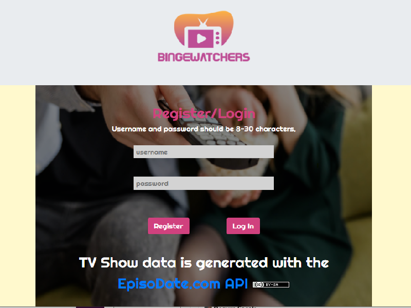
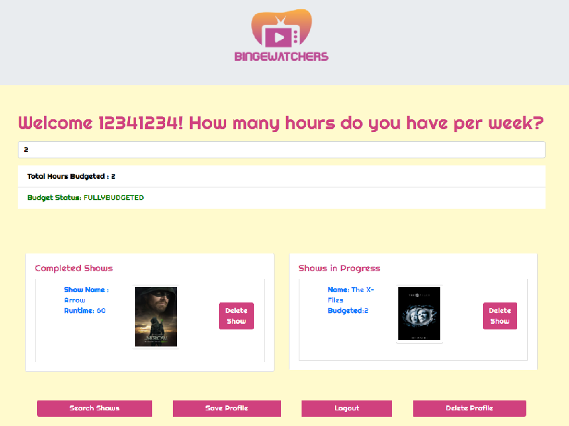
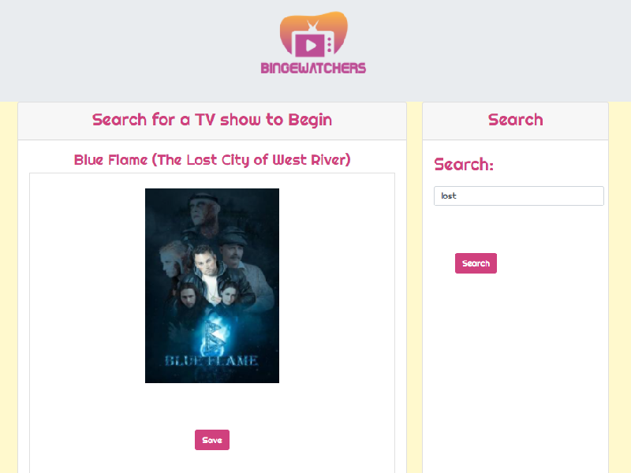
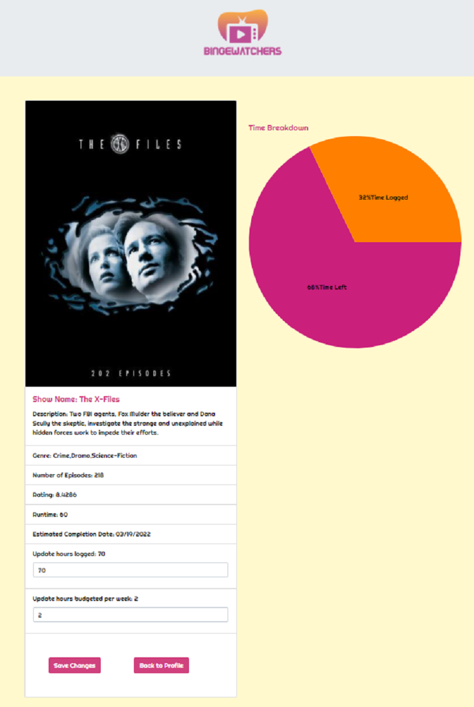

# BINGEWATCHERS

  ## Description:
  BINGEWATCHERS is a React app that allows you to budget your time and track your progress for watching TV shows. 

  ## Links:
  * [Repo](https://github.com/kurt-austin/bingewatcher)
  * [Deployed Site](https://ancient-plateau-69456.herokuapp.com/)

  ## Table of Contents:
  * [Installation](#installation)
  * [Usage](#usage)
  * [Technology Used](#technology-used)
  * [Questions](#questions)
  * [Screenshots](#screenshots)

  ## Installation:
  * Install dependencies by running "npm install" from the terminal.
  
  ## Usage:
  * Run "npm start" from the terminal to start the server.

  ## Technology Used:
  * Node.js - for JS runtime environment
  * JS/ES6+ - for program logic
  * Bootstrap & React Bootstrap - for responsive style
  * React - for components and state handling and component routing
  * Sequelize ORM - for DB object relational mapping
  * MySQL - for storing user profile information and tracking TV show progress
  * Express - for serving
  * Passport.js/Bcrypt - for authentication and encryption
  * bootstrap - for responsive design
  * HTML - layout
  * CSS - for custom style
  * episodate.com/api - for TV show data
  * react-minimal-pie-chart - for charting
  * axios - for API calls

  ## Questions:
  * https://github.com/begumsacak
  * https://github.com/Marissa-Mayes
  * https://github.com/kurt-austin
  * https://github.com/locutusOO1

  ## Screenshots:

  ### Login
  

  ### Profile
  

  ### Search
  

  ### Detail
  